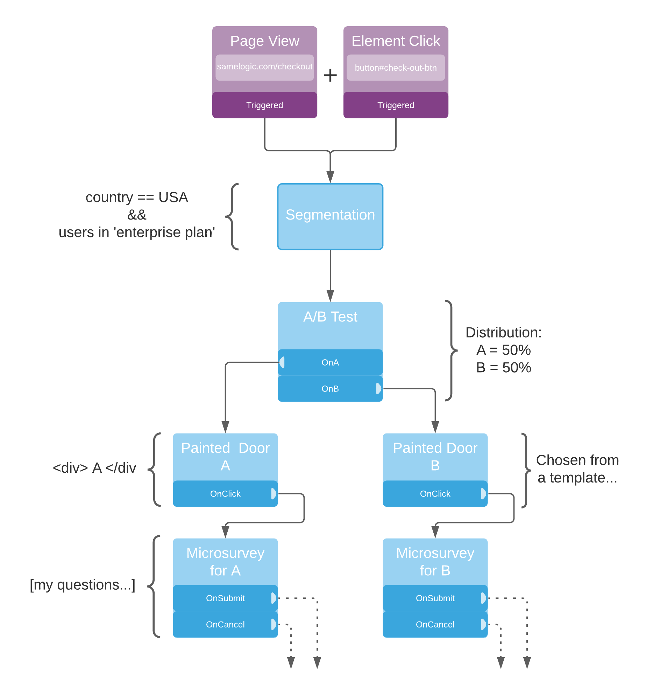

Samelogic is a Product Experimentation platform that enables you to conduct lean experiments for quickly validating ideas, such as Painted Doors, AB tests, etc.

You can build complex workflows for your experiments that will provide you with both quantitative and qualitative insights. An example is running a split test of a painted door with a microsurvey attached. This workflow can be seen below:

For more information on how Workflows, see the [Workflows documentation](./workflows).

---

  <h4>Tutorial</h4>
  Learn how to implement Samelogic Microsurveys within your product.

[Try the Tutorial](./tutorials)

  <h4>References</h4>
  Nitty-gritty descriptions of how Samelogic Microsurveys work.

[View References](./references)

  <h4>Release Notes</h4>
  Stay up-to-date with all our major and minor releases.

[Read Release Notes](./release-notes)

