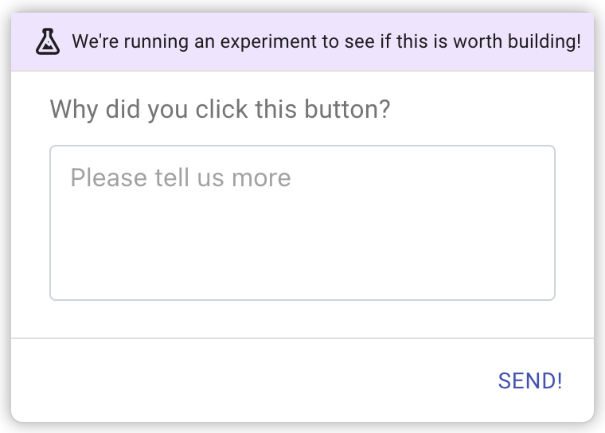

Microsurveys is a powerful in-app survey that can be configured to be displayed during any user flow or activity to collect contextual
feedback, that can be sent to any app of your choice.

## What can you do with Microsurveys?

These are usually short surveys that collect user feedback on a specific user behavior in an application.

### Proposed Features

To test whether or not a feature hypothesis should be built, sometimes dummy elements (called painted doors) are displayed to the user.
By attaching a microsurvey to the user interaction of these elements, both qualitative and quantitative information may be gathered to help
make a decision.

Information such as a simple vote to targetted open ended questions can be used.

### Feature Improvement

As products evolve, testing whether effort needs to be spent on improving a feature and what kind of improvement it should be. By collecting feedback after a user has completed an action, during or after a user flow, using targeted questions can help product and UX decisions.

Information such as NPS, thumbs up/down and targetted open ended questions can be used.

### Churn
