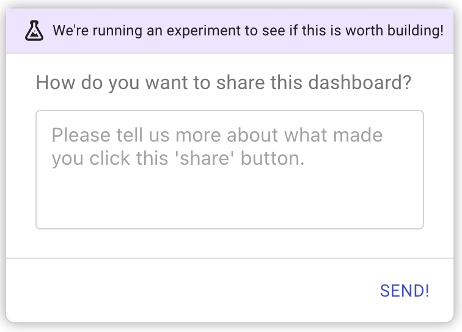

Microsurveys is a powerful in-app survey displayed during any user flow or activity to collect contextual feedback sent to any app of your choice. Microsurveys are great for collecting qualitative and quantitative feedback about specific features from users.

## What can you do with Microsurveys?

These are usually short surveys that collect user feedback on specific user behavior in an application.

### Proposed Features

To test whether a product team should build a feature hypothesis, sometimes fake elements (called painted doors) are displayed to the user.
By attaching a microsurvey to the user interaction of these elements, the team may gather both qualitative and quantitative information to help
make a decision.

The following are some question types best suited for this use case:

- Yes/No votes.
- Calibrated Open-Ended Questions

### Feature Improvement

As products evolve, product teams should test whether they should spend effort on improving an existing feature. Collecting feedback after a user has completed an action, such as during or after a user flow, can help product and UX make better decisions.

The following are some question types best suited for this use case:

- Thumbs Up/Down
- Emojis
- Calibrated Open-Ended Questions

### Reducing Churn

Product organizations need to understand why users stop using their products. A method of churn inside the product is to de-activate or delete their account. By placing a microsurvey in the churn process flow, organizations can gain insights into why users no longer wish to use the product.

Microsurveys are capable of using logic to show questions based on selection/responses. Product Managers can use this branching logic to detect why churn happens and possibly point them to features or use cases to deter churn.

Please see [Reducing User Churn tutorial](/tutorials/how-to-reduce-user-churn) for a more detailed explanation.
