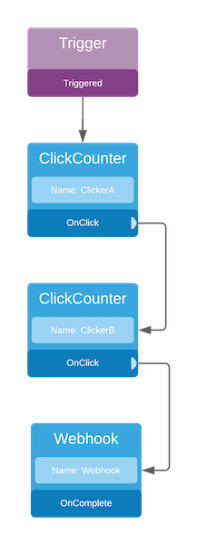
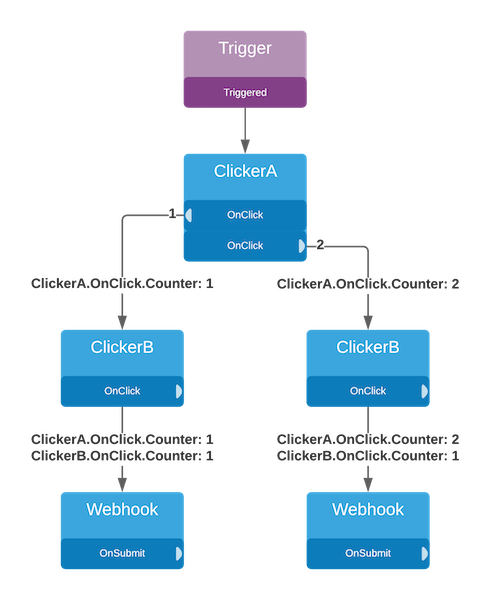

You can configure steps by setting their property values. You can configure the property values to map data from previous step events or set the values directly.

All steps will have access to a context containing a list of all the steps, their events, and the event data. This behavior allows you to pass data around, transform, make decisions, etc.

## Context

Accessing data on this context is done like this: `{{step-name.event-name.property}}` where:

- `step-name` - The name you gave to a step.
- `event-name` - The name of the event for that given step that was fired.
- `property` - The property of the event data.

:::info
Context data are immutable and cannot be changed by any steps.
:::

## Dataflow

We will use a simple example of a workflow to demonstrate how data flows between steps:



The `ClickCounter` will keep track of how many times the user clicks a specified element. This step also exposes an `OnClick` event that will pass the counter to the next step.

This event data has the following schema:

```
{
  Counter: integer
}
```

For the sake of showing how the Workflow builds the context, we will use 2 `ClickCounter` sequentially that will send that data to a Webhook step.

### Single Execution

The following shows a data flow of the workflow execution. It shows the shape of the data being passed to each step when the events are fired:


Take note of the schema:

- When **ClickerA** is clicked, it passes a context of the following data:

```json
{
  "ClickerA": {
    "OnClick": {
      "Counter": 1
    }
  }
}
```

- When **ClickerB** is clicked, it passes the following:

```json
{
  "ClickerA": {
    "OnClick": {
      "Counter": 1
    }
  },
  "ClickerB": {
    "OnClick": {
      "Counter": 1
    }
  }
}
```

The Workflow added the new event and its data to the context. So the webhook step now has access to both event data.

### Multiple Executions

The following shows a data flow where the event of a step **ClickerA** is fired twice:



This data flow tells us that **ClickerA** then **ClickerB** was clicked. The user repeated this two times.

Here we can see that the first try, the context that went to the webhook had `ClickerA.OnClick.Counter: 1`.
On the second set of clicks, the context for **ClickerA** has changed to `ClickerA.OnClick.Counter: 2` but **ClickerB** hasn't changed. This is because all executions of other steps are disposed of when the event is fired twice.

**ClickerA** was never disposed of. Therefore the state changed, and the context was updated.
**ClickerB** was disposed of when **ClickerA** was clicked, so the second pass was a brand new step, which is why the counter value is still **1**.

:::caution
When an event is fired multiple times, the Workflow will dispose of all previously executed steps to run new steps.
:::
