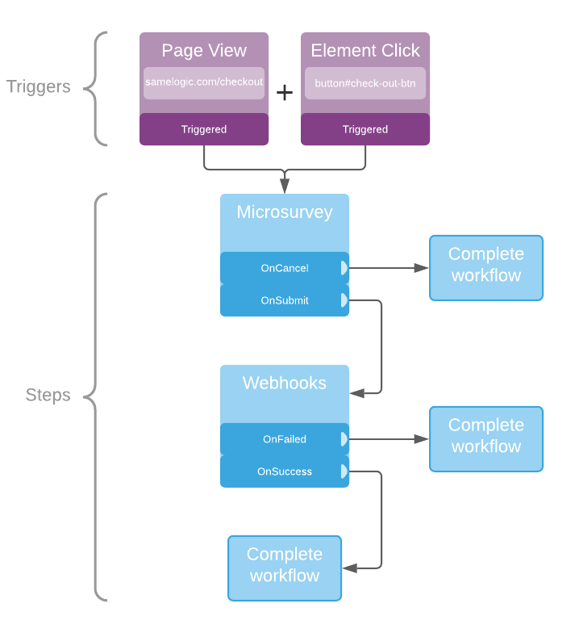

Workflows make it easy to run various actions that should happen for an experiment. Workflows are made up of one or more steps that can be executed by one or more trigger events.

#### Triggers

Triggers are a a list of events that occurs in the application to start the workflow. For example, a trigger can be configured to fire when the user clicks on an element on a specific page. Please see [Triggers Overview documentation](./workflows/triggers) for more details.

#### Steps

Steps are a set of actions that are executed after a workflow is triggered. Please see [Steps Overview documentation](./steps)

### The stages of a Workflow

You can build your own experiments by composing a workflow whose complexity can range from a simple painted door to complex multi-variance test that collects a wide variety of quantitative and qualitative metrics.

The experiment below is configured to collect feedback when the checkout button is clicked on the checkout page.

The workflow can be configured so that if the user has either canceled or submit the feedback, the default order behavior will continue.
:::note
This will work for navigating away with anchor tags or form submissions.
:::

The workflow above contains 2 triggers that must match before the workflow begins executing the steps. The two triggers represents clicking a specific element while on a specified page.

The workflow contains 2 steps. A Microsurvey step that will complete the workflow if it is canceled or it will pass the collected data to a Webhook step. The webhook step will attempt to send this data to a url and will complete the workflow if the request failed or succeed.
